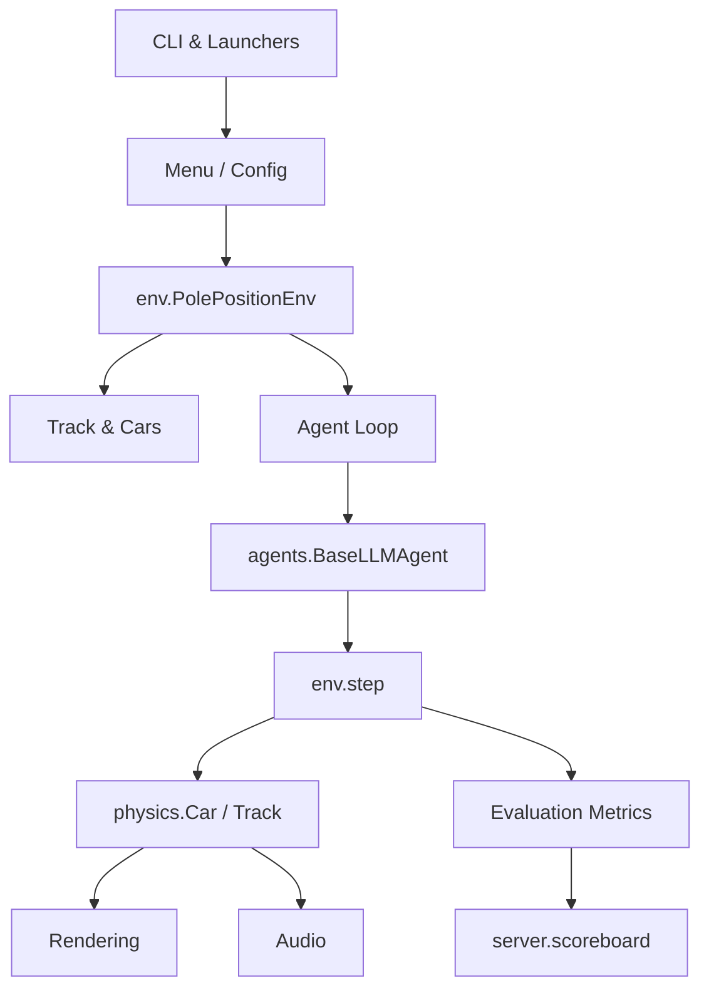

# 🏎️ Game Flow Overview

This document outlines the main runtime flow of **Super Pole Position**.
Each box in the diagram represents a module or object in the codebase that drives a
specific aspect of the game.

The flow starts with the **CLI** (`super_pole_position.cli` or `press_start.py`) which sets up
the desired options via the menu. A `PolePositionEnv` instance then loads the
track, spawns cars and manages game state. Agents provide actions each frame and
`env.step()` processes physics, collision logic and scoring. The renderer draws
road, sprites and HUD while the audio module mixes engine and effects. When a
race ends, metrics are summarised and optionally submitted to the local or remote
scoreboard service.
